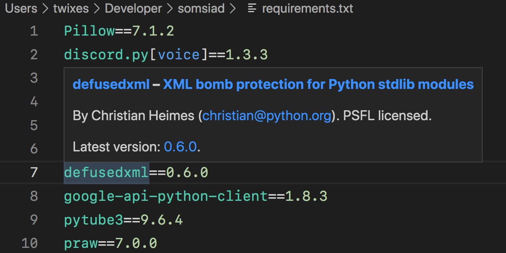

# [Python PyPI Assistant for VS Code](https://marketplace.visualstudio.com/items?itemName=twixes.pypi-assistant)

Handy hover tooltips + CodeLens for dependencies from PyPI – similar to what VS Code has built in for dependencies in `package.json`.

Gain access to: package name, description, author(s), license, and latest version at a glance, with links in case you need more details.

Supported formats:

-   [pip requirements files](https://pip.pypa.io/en/stable/user_guide/#requirements-files) – `requirements.txt`, `requirements.in`, `constraints.txt`, and such
-   [Poetry](https://python-poetry.org/docs/pyproject/#dependencies-and-dependency-groups) – `pyproject.toml`'s `tool.poetry.dependencies`
-   [PEP 631](https://peps.python.org/pep-0631/) – `pyproject.toml`'s `project.dependencies`/`project.optional-dependencies`
-   [PEP 735](https://peps.python.org/pep-0735/) - `pyproject.toml`'s `dependency-groups`
-   [uv](https://docs.astral.sh/uv/reference/settings/) - `pyproject.toml`'s `tool.uv.constraint-dependencies`/`tool.uv.dev-dependencies`/`tool.uv.override-dependencies`
-   [Pixi](https://pixi.sh/v0.25.0/advanced/pyproject_toml/) - `pyproject.toml`'s `tool.pixi.dependencies`/`tool.pixi.feature.*.dependencies`

This extension depends on [Microsoft's official Python extension](https://marketplace.visualstudio.com/items?itemName=ms-python.python) for `pip requirements` language support.
